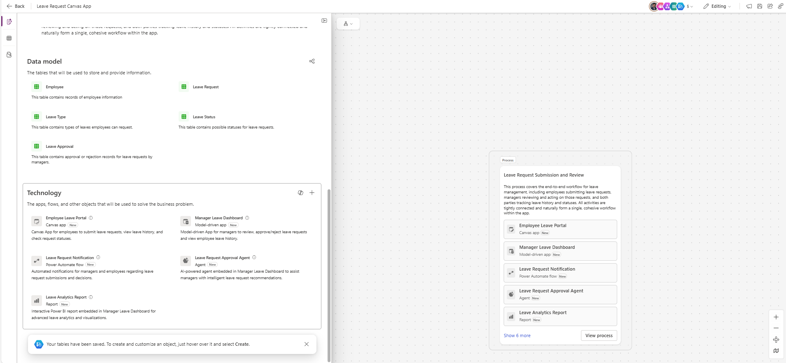

# Leave Management App

## Description

This prompt helps create an internal app to manage employee leave requests. The app allows employees to submit leave requests with type, start and end dates, and reason. Managers can approve or reject requests, and users can view their leave history. The app ensures efficient tracking of leave across the organization with role-based access and responsive design.

## Prompt

Build an Canvas Power App for leave management.

- Employees can submit leave requests including type, start date, end date, and reason.
- Managers can review, approve, or reject leave requests.
- Display leave history for each employee.
- Implement role-based access for Employees and Managers.
- Use modern Power Apps controls with a responsive layout and company branding.

### Supported Language(s)

[English](./en-us/prompt.md)

## Authors

| Solution             | Author(s)                                                                                                                      |
| -------------------- | ------------------------------------------------------------------------------------------------------------------------------ |
| Leave Management App | [Summit Bajracharya](https://www.github.com/summitbaj) ([@SummitBajracharya](https://twitter.com/SummitBajracharya)), Signetic |

## Minimal Path to Awesome

1. Copy the prompt.
2. Paste the prompt into Power Apps Co-pilot.
3. Generate the app and customize it as needed.

## Disclaimer

**THIS CODE IS PROVIDED _AS IS_ WITHOUT WARRANTY OF ANY KIND, EITHER EXPRESS OR IMPLIED, INCLUDING ANY IMPLIED WARRANTIES OF FITNESS FOR A PARTICULAR PURPOSE, MERCHANTABILITY, OR NON-INFRINGEMENT.**

